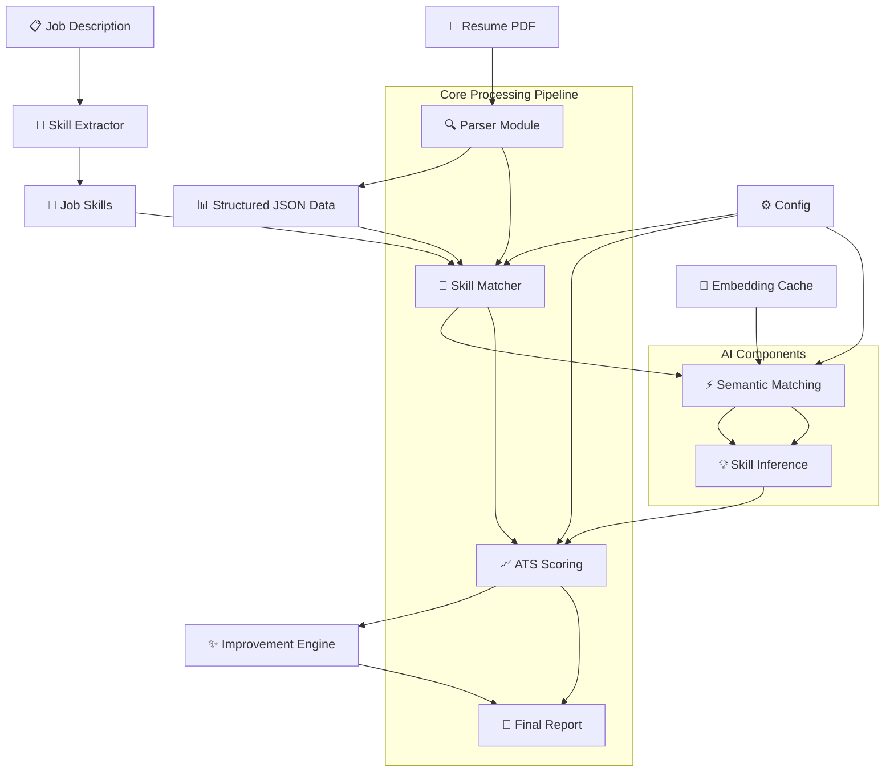

***Resume Analysis & ATS Matching System***
**-----------------------------------------------**

A comprehensive AI-powered system for resume parsing, skill matching, and ATS (Applicant Tracking System) optimization.

***📋Overview***

This system provides end-to-end resume analysis with the following capabilities:

Resume Parsing: Extract structured information from PDF resumes

Skill Matching: Semantic matching between resume skills and job requirements

ATS Scoring: Calculate compatibility scores for job applications

Resume Improvement: AI-powered suggestions for enhancing resume sections

Skill Inference: Automatic expansion of related skills based on existing ones

🏗️ Architecture Overview

### Architecture Components:

| Layer | Component | Purpose |
|-------|-----------|---------|
| **📥 Input** | Resume PDF, Job Description | Raw data ingestion |
| **🔍 Processing** | Parser, Skill Extractor, Semantic Matcher | Data extraction & analysis |
| **🧠 Intelligence** | Skill Inference, Embedding Models | AI-powered insights |
| **📊 Scoring** | ATS Engine, Match Calculator | Compatibility assessment |
| **✨ Enhancement** | Improvement Engine | Optimization suggestions |
| **🎯 Output** | Final Report, Scores, Recommendations | Actionable insights |

***Architecture Components***:

Layer	Component	Purpose
📥 Input	Resume PDF, Job Description	Raw data ingestion
🔍 Processing	Parser, Skill Extractor, Semantic Matcher	Data extraction & analysis
🧠 Intelligence	Skill Inference, Embedding Models	AI-powered insights
📊 Scoring	ATS Engine, Match Calculator	Compatibility assessment
✨ Enhancement	Improvement Engine	Optimization suggestions
🎯 Output	Final Report, Scores, Recommendations	Actionable insights
🏗️ Project Structure

***🏗️ Project Structure***

project/
├── 📁 Matching/                    # Core matching functionality
│   ├── SkillMatcher.py            # Main matching pipeline
│   ├── semantic_skill_matcher.py  # Semantic similarity matching
│   ├── skill_inference.py         # Skill expansion logic
│   ├── skill_inference_map.py     # Skill relationship mappings
│   ├── calculate_skill_match.py   # Match percentage calculation
│   ├── aggregate_score.py         # ATS scoring algorithm
│   ├── build_embeddings.py        # Embedding generation/caching
│   ├── compute_similarity.py      # Cosine similarity computation
│   ├── config.py                  # Configuration settings
│   ├── embed_text.py              # Text embedding utilities
│   ├── expand_skill.py            # Compound skill expansion
│   ├── extract_job_skill.py       # Job description skill extraction
│   ├── hybrid_match.py            # Hybrid matching strategies
│   ├── load_embedding.py          # Embedding loading utilities
│   ├── normalize_text.py          # Text normalization
│   ├── save_embedding.py          # Embedding saving utilities
│   └── skill_mapping.py           # Skill normalization mappings
│
├── 📁 Model/
│   └── initalise_model.py         # LLM model initialization
│
├── 📁 Parser/
│   ├── ResumeParser.py            # Main resume parsing class
│   ├── fix_json.py                # JSON repair utilities
│   └── resume_text_extract.py     # PDF text extraction
│
├── 📁 Json_Extraction/
│   ├── skills_json.py             # Skill extraction from JSON
│   └── proje_exp_ach_json.py      # Section-specific extraction
│
├── 📁 Improvements/
│   └── ResumeImprovement.py       # Resume enhancement module
│
├── 📄 main.py                     # FastAPI application
├── 📄 requirements.txt            # Python dependencies
├── 📄 parsed_resume.json          # Sample parsed resume output
└── 📄 skill_embeddings.pt         # Cached skill embeddings

***📂 Directory Overview***

Directory	Purpose	Key Files
📁 Matching/	Core matching & scoring logic	SkillMatcher, semantic matching, ATS scoring
📁 Model/	AI model initialization	LLM setup and configuration
📁 Parser/	Resume parsing utilities	PDF extraction, JSON repair, parsing
📁 Json_Extraction/	JSON data extraction	Skills, projects, experience extraction
📁 Improvements/	Resume enhancement	AI-powered improvements
📄 Root Files	Application entry points	Main app, dependencies, cache files

***🚀 Features***

1. Resume Parsing
Extract structured data from PDF resumes
Parse profile information, education, work experience, projects, achievements
Handle malformed JSON with robust repair mechanisms

2. Skill Matching & ATS Scoring
Semantic Matching: Uses sentence transformers for intelligent skill matching
ATS Score: Percentage-based compatibility scoring
Confidence Threshold: Configurable matching threshold (default: 0.75)

3. Multi-level Analysis:
Direct skill matches
Inferred skill matches
Weighted scoring (70% job coverage, 30% resume breadth)

4. Skill Inference
Automatic expansion of related skills
Domain-specific inference mappings (AI/ML, Web Dev, Data Science, etc.)
Configurable inference enabling/disabling

5. Resume Improvement
AI-powered section enhancement
Context-aware improvements based on job role
Professional phrasing and formatting suggestions

***🛠️ Installation***
Prerequisites
Python 3.8+
Groq API key for LLM access

***📊 Output Metrics***
The system provides comprehensive analysis including:
ATS Score: Overall compatibility percentage
Match Percentage: Weighted skill coverage
Matched Skills: Specific skill pairs with similarity scores
Unmatched Skills: Skills lacking in resume or job description
Inferred Skills: Automatically expanded relevant skills
Confidence Levels: Individual match confidence scores

***🚨 Error Handling***
The system includes robust error handling for:
Malformed PDF files
Invalid JSON responses from LLM
Network timeouts
Missing required fields
Embedding generation failures

***📈 Performance***
Embedding Cache: Skills embeddings are cached for faster subsequent runs
Batch Processing: Efficient batch processing of text embeddings
Memory Efficient: GPU-optimized tensor operations
Parallel Processing: Concurrent skill matching operations

***🔮 Future Enhancements***
Multi-language support
Industry-specific skill mappings
Real-time collaboration features
Advanced ATS optimization suggestions
Integration with job boards
Resume template generation

***🤝 Contributing***
Fork the repository
Create a feature branch
Make your changes
Add tests if applicable
Submit a pull request

***📄 License***
This project is licensed under the MIT License - see the LICENSE file for details.

🆘 Support
For support and questions:
Check the documentation
Open an issue on GitHub
Contact the development team

