# 🧠 AI Resume Analyzer & ATS Scoring System

This project is an **AI-powered Resume Analyzer** that evaluates resumes against job descriptions, provides **semantic skill matching**, and calculates an **ATS (Applicant Tracking System) score**. It leverages **Natural Language Processing (NLP)** and **semantic similarity models** to analyze candidate profiles and recommend improvements.

---

## 🚀 Features

- 📄 **Resume Parsing:** Automatically extracts text, skills, and experience from PDF resumes.  
- 🧩 **Semantic Skill Matching:** Uses sentence embeddings to compare job requirements with candidate skills.  
- 📊 **ATS Score Calculation:** Computes a weighted score based on keyword and semantic similarity.  
- 💡 **AI-Based Suggestions:** Provides tailored recommendations to enhance resume relevance and ATS compatibility.  
- 🌐 **FastAPI Backend:** RESTful API endpoints for parsing, scoring, and serving AI results.  
- 🧱 **Modular Design:** Each module (parser, scorer, suggestion engine) is independent for easy integration.

---

## 🧩 Project Structure

*System Architecture Overview*

---
## Tech Stacks

| Category | Tools & Libraries |
|-----------|-------------------|
| **Language** | Python 3.10+ |
| **Backend Framework** | FastAPI |
| **LLM Framework** | LangChain |
| **LLM Provider** | Groq (Llama 3.1 8B Instant) |
| **NLP Models** | Sentence Transformers (`all-MiniLM-L6-v2`) |
| **AI/ML** | PyTorch, Transformers |
| **Data Handling** | pandas, numpy |
| **Text Parsing** | PyPDF2, python-docx |
| **API Development** | Uvicorn, Pydantic |
| **Deployment** | Docker (optional) |

---

## Architecture Overview

## 🏗️ Architecture Overview

```mermaid
graph TB
    A[📄 Resume PDF] --> B[🔍 Parser Module]
    B --> C[📊 Structured JSON Data]
    
    D[📋 Job Description] --> E[🎯 Skill Extractor]
    E --> F[🔧 Job Skills]
    
    C --> G[🧠 Skill Matcher]
    F --> G
    
    G --> H[⚡ Semantic Matching]
    H --> I[💡 Skill Inference]
    I --> J[📈 ATS Scoring]
    
    J --> K[✨ Improvement Engine]
    K --> L[🎊 Final Report]
    
    M[⚙️ Config] --> G
    M --> H
    M --> J
    
    N[💾 Embedding Cache] --> H
    
    subgraph "Core Processing Pipeline"
        B --> G --> J --> L
    end
    
    subgraph "AI Components"
        H --> I
    end
```

## Author
Ketan Gupta
Data Science Enthusiast

## License
This project is licensed under the MIT License — feel free to use, modify, and distribute it.
